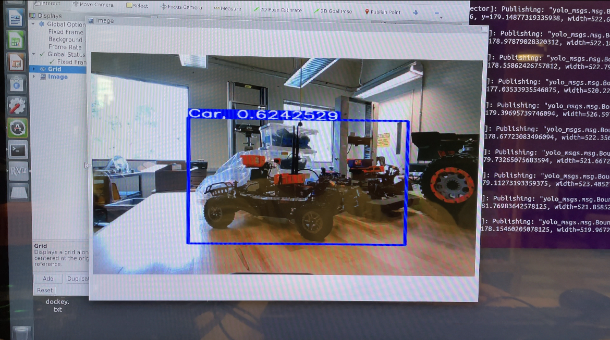
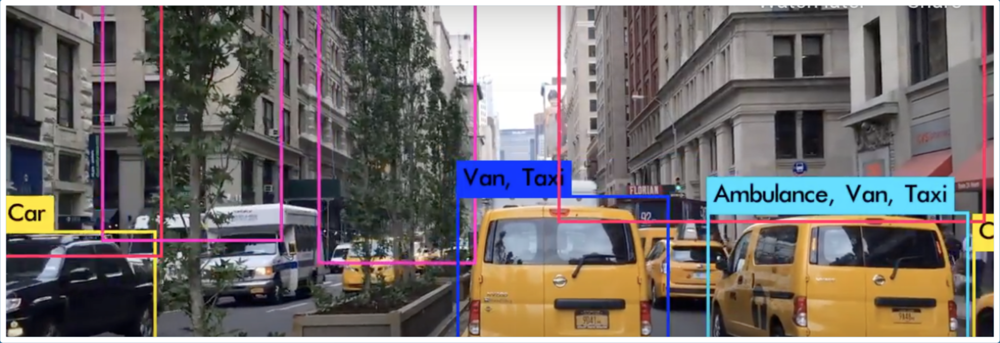
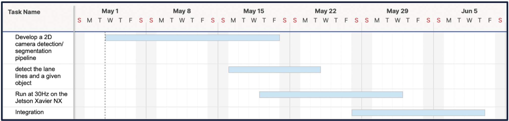

# 2D Object Detection
### Brian Huang, Loren Phillips, Tatum Maston

# Summary

Detecting objects is a fundamental part of successful autonomous car navigation. Using ROS2 and the YOLO algorithm, we designed a 2d Object Detection package. The goal of this project was to succesfully detect cars at a high frame rate and publish important information to other teams so that they can succesfully use this data to help the F1 Tenth cars navigate. Using the YOLO object detection algorithm, we were able to succesfully detect other F1 Tenth cars and publish the location of those cars in the detected image.

This package was developed as a part of DSC 190 (Introduction to Robot Perception and Navigation).


<INSERT SUMMARY>

# Overview 
The following package utilizes the following:

A ROS2 Image Subsriber that subscribes to the `/camera/color/image_raw` topic. This image is published by the Intel Realsense Camera.

A ROS2 Image Publisher that publishes images that have a bounding box with a class label and confidence number to the topic `yolov5_boxes`.

A ROS2 Image Publisher that uses a custom message that publishes the dimensions of a bounding box, the confidence, and whether there was a detection to the topic `/bounding_images`.

The YOLO model trained on F1Tenth car images collected from the internet and from the UCSD Triton AI lab.

Our package publishes a custom message that follows the following format:
```
bool detection
float64 probability
float64 x
float64 y
float64 width
float64 height
```

It also publishes a live image feed viewable using `rviz2`.

# Installion
## If you have not created a Docker container

**Start by enabling X_11 Port Forwarding**
On your *host* machine (not the Jetson) enter the following into the command prompt. This will allow us to view the live-image feed later.
```
xhost +
```
You can now proceed to SSH into the Jetson
```
ssh -X jetson@ip-address/host-name
```
On the *Jetson* run:
```
sudo usermod -aG docker ${USER}
su ${USER}
```
This is so we can use Docker commands/have sudo access
You can check if it worked using:
```
xeyes
```
**Running the Docker Container**
Run the command:
```
xhost +
```
and proceed to SSH into the Jetson
```
ssh -X jetson@ip-address/host-name
```
Create your docker container. We can create a bash script to help us do so:
```
touch docker_ucsd.sh
nano docker_ucsd.sh
```
Paste the following (from Dominic Nightingale)
```
docker run \
    --name ${1}\
    -it \
    --privileged \
    --net=host \
    -e DISPLAY=$DISPLAY \
    --device /dev/video0 \
    --volume="$HOME/.Xauthority:/root/.Xauthority:rw" \
    djnighti/ucsd_robocar:${2:-latest}
```

You can now enter the docker using:
```
bash docker_ucsd.sh test_container 
```
Note: test_container can be changed to whatever you want to name your Docker Container

## If you have created a Docker Container
Proceed to SSH into the Jetson
```
ssh -X jetson@ip-address/host-name
```
Run the command:
```
xhost +
```
Once in the Jetson run:
```
docker start <name of docker container>
docker exec -it <name of docker container> /bin/bash
```
You can now proceed to source ROS2 and clone the Git repository
```
source_ros2

#move to where your source folder is
cd src

git clone https://github.com/brianjhuang/2d-object-detection.git
```

## Installing YOLOV5
    
YoloV5 is an object detection algorithm previously built using TensorFlow and currently maintained using PyTorch.
YOLO stands for You Only Look Once, and it's an algorithm for real-time object detection and recognition in images. Uses convolutional neural networks to identify objects. 
    
    
[image credits](https://youtu.be/69Ii3HjUiTM)
    
    
In your source folder clone the YOLOV5 repository.
https://github.com/ultralytics/yolov5

```
cd src
git clone https://github.com/ultralytics/yolov5.git
```
Go ahead and move into the YOLOV5 folder, we want to install all the requirements now. This may take a while.

```
pip install -r requirements.txt
```

There are many great tutorials out there on how to train a YOLOV5, but here is what I recommend:
For labelling images use: https://roboflow.com/

To learn how to train the model: https://towardsdatascience.com/how-to-train-a-custom-object-detection-model-with-yolo-v5-917e9ce13208

Note: For the towards data science article, you can skip the installion steps. 

After training, you should get a 'best.pt' file! Save this, this is our model weights.

## Modifying Code and Filepaths
**Note: This is a temporary fix, a workaround is being looked into**
Begin by exporting the Python Path inside the Docker container. **YOU MUST BE IN YOUR DOCKER CONTAINER**
```
export PYTHONPATH="src/yolov5"
#note the filepath should be the full filepath, I have just left it as src/yolov5

echo $PYTHONPATH
#the filepath should be appended to the end of the file
```
Inside of our **car_detector.py**, modify line 75.
``` Python
self.weights = '/home/projects/ros2_ws/src/dsc-178/yolov5/runs/train/car_det/weights/best.pt' #directory of the weights
#replace the directory with the location of your best.pt file
```

## Build, Source, Launch
Now that we have all of packages installed and our model loaded, let's build and launch!
```
colcon build
source install/setup.bash
```
Start by launching the realsense. We can do this by using the pre-built docker container.
```
ros2 launch ucsd_robocar_nav2 all_components.launch.py
#note this should autocomplete and filepath may differ
```
If the realsense is not launching, you may need to modify the `config.yml` file and sent Intel:0 to Intel:1

Open a seperate terminal and run:
```
source_ros2

export PYTHONPATH="src/yolov5"
#note the filepath should be the full filepath, I have just left it as src/yolov5

source install/setup.bash

ros2 launch car_detector_pkg car_detector_pkg_launch_file.launch.py
```

To see the live feed, open another terminal and run:
```
source_ros2

rviz2
```

Inside of `rviz2` add a new window and select Image from the `/bounding_images` publisher.

# Challenges Faced and What We Hope To Add
There were many hurdles that we faced throughout the development of this package.

For all of us, this was the first time working with ROS2, meaning that there was a steep learning curve. Even now there are certain things in our code that could be written better and improved on with more experience using ROS2.

Training the model and gathering data was difficult. There is not a large existing databse of F1Tenth cars, so most of the data we collected was our own. This meant we had limited variety in the types of cars the model could see. The model itself struggles with cars at certain angles and lighting, and something we can do to improve that is collect more data. Adding more variety and noise in our data could also aid the model's accuracy.

Installion of certain packages and importing submodules had issues. This was solved with the EXPORT PYTHONPATH workaround, but it was something that consumed around a week worth's of time.

The detections are slow, since we were only able to run the model on the Jetson's CPU. One thing we hope to add in the future is GPU acceleration. 

We struggled to get multiple detections and multi-class detections. This also can be fixed with a larger more robust dataset and model tweaks.

Given more time these can all be resolved, and we hope that people who continue to improve this code to do so!

# Development Timeline


    
Week 6: Proposed the use of the YOLOv5 model as a method to detect objects.
    
Week 7: Collected data for our model. Trained three iterations of our model. The final model was able to detect cars with around 80% accuracy.
    
Week 8: Developed the subscriber and publisher nodes neccesary to collect the images for our model to run inference on and publish the custom message containing information about the bounding box and model predictions.

Week 9: Began integration of the YOLOv5 model with ROS2 subscribers and publishers. Ran into issues import dependencies and spent most of the week debugging issues with file paths and object detection. 
    
Week 10: Finished integration of the YOLOv5 model with ROS2 topics. Fixed scaling issues with the projected bounding box on the image. Added an image publisher to send a live stream of images to `rviz2`. Looked into possible GPU acceleration in the future and possible improvements on the model.
    
# References
The docker container we used and documentation are from Dominic Nightingale.
https://gitlab.com/ucsd_robocar2/ucsd_robocar_hub2

# Acknowledgments

Thank you to the Data Science Department for the unique opportunity to work on a F1Tenth car with hardware that is inaccesbile to many students! A special thanks to Professor Silberman, and our TAs Tanmay and Siddarth. Without all of your open resources and aid, this package would never come to fruition. 

